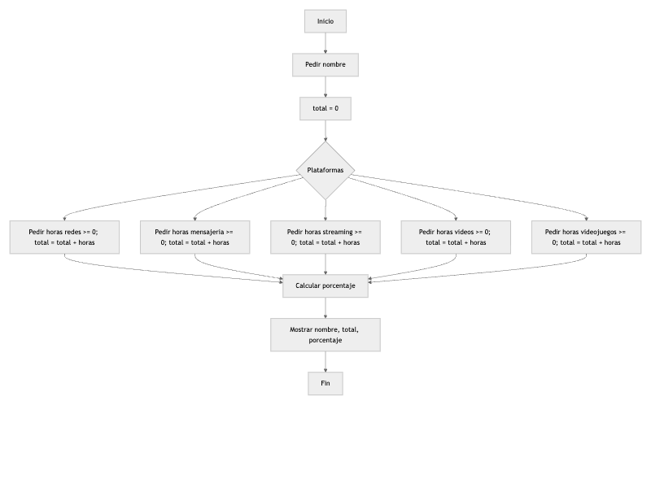
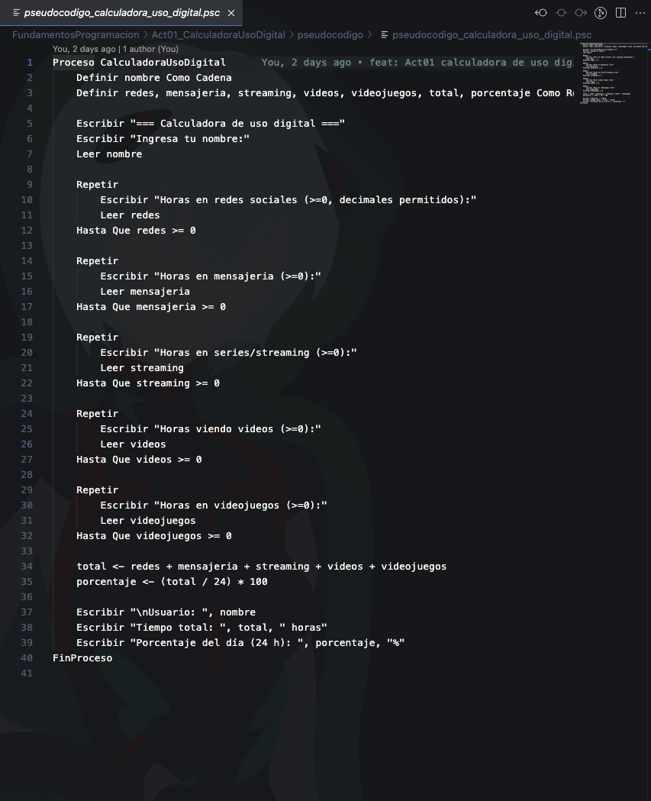
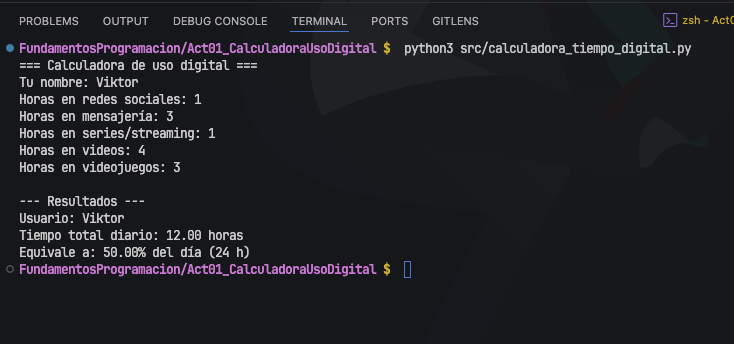

# Act 1 – Calculadora de uso digital

**Descripción**: Calcula el total de horas diarias dedicadas a plataformas digitales y el **porcentaje del día (24 h)** que representan.


## Diagrama de flujo (Mermaid)


> Si no ves el diagrama en VS Code, instala **Markdown Preview Mermaid Support** o **Markdown Preview Enhanced** y abre el preview (⌘⇧V / Ctrl+Shift+V).

## Pseudocódigo (PSeInt)
Consulta `pseudocodigo/pseudocodigo_calculadora_uso_digital.psc`


## Código (Python)
Archivo principal: `src/calculadora_tiempo_digital.py`

### Ejecución
```bash
# macOS / Linux
python3 src/calculadora_tiempo_digital.py

# Windows
python src\calculadora_tiempo_digital.py
```

